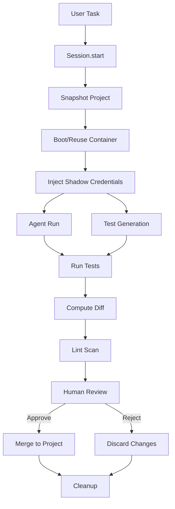

FTL implements a **zero-trust control plane** for AI coding agents. The architecture isolates agents inside Docker sandboxes, replaces real credentials with shadow values, runs adversarial tests in parallel, and enforces human-in-the-loop approval before any changes touch your project.

## Core Design Principles

1. **Agent Isolation** — Agents run entirely inside Docker containers with no direct access to the host filesystem
2. **Shadow Credentials** — Real API keys never enter the sandbox; agents see generated fake values
3. **Parallel Verification** — Tests generate while the agent codes, running immediately when both finish
4. **Diff-Driven Merge** — Changes are computed on-demand and applied only after explicit human approval
5. **Persistent Containers** — One container per project, warm across tasks to eliminate cold-boot overhead

<Info>
The agent cannot have skin in the game. The human must. Every change requires explicit approval before it touches the real filesystem.
</Info>

## Session Lifecycle

When you run `ftl code "your task"`, the system executes this sequence:

```
1. SNAPSHOT      — rsync project state to ~/.ftl/snapshots/<id>
2. BOOT          — reuse persistent container or start fresh (per project)
3. INJECT        — shadow credentials replace real keys inside sandbox
4. AGENT ∥ TESTS — coding agent runs; adversarial tests generate in parallel
5. RUN TESTS     — pre-generated tests execute the moment the agent finishes
6. LINT          — diff scanned for credentials and dangerous operations
7. DIFF          — computed on demand; file-level review of all changes
8. APPROVE       — human reviews, asks questions, merges or rejects
```

## Key Components

### Session (`orchestrator.py:96-416`)

The `Session` class manages the entire lifecycle of a coding task. It coordinates:

- Snapshotting project state
- Booting or reusing containers
- Shadow credential injection
- Parallel agent + test execution
- Diff computation and review
- Merge/reject decisions

### Agent Adapters (`agents/`)

Abstract interface for different coding agents (Claude Code, Codex, Aider, Kiro). All agents:

- Execute inside the sandbox via `sandbox.exec()` or `sandbox.exec_stream()`
- Support initial tasks and follow-up messages
- Stream output line-by-line when a callback is provided

### Sandbox (`sandbox/docker.py`)

Docker-based isolation layer providing:

- Persistent containers keyed by project path hash
- Workspace reset from snapshots on each task
- Environment variable injection (credentials + agent auth)
- Command execution with streaming support
- Linux-internal diff computation

### Credential System (`credentials.py` + `proxy.py`)

Two-layer security model:

1. **Shadow injection** — Fake credentials injected into container environment
2. **Network proxy** (optional) — MITM proxy swaps shadow→real values at the network layer for live API calls

<Note>
The proxy requires the `cryptography` package (`pip install -e '.[proxy]'`). Without it, agents see only shadow values and live API calls will fail.
</Note>

## Data Flow



## Persistence Model

| Location | Lifecycle | Contents |
|----------|-----------|----------|
| `~/.ftl/snapshots/<id>/` | Per task | Project state at task start |
| `~/.ftl/containers/<hash>` | Per project | Persistent container ID |
| `/workspace/` (container) | Reset per task | Working directory from snapshot |
| `/home/ftl/.local/` (container) | Persistent | User-installed packages |
| `/home/ftl/.claude/` (container) | Persistent | Agent conversation history |

## Parallel Execution

FTL uses Python's `ThreadPoolExecutor` to run the agent and test generator in parallel:

```python
with ThreadPoolExecutor(max_workers=2) as executor:
    agent_future = executor.submit(_run_agent)
    test_future = executor.submit(generate_tests_from_task, task, self.tester)
```

Tests are usually ready before the agent finishes, so verification runs immediately when coding completes.

## AWS Integration Points

FTL supports optional AWS-backed capabilities:

- **S3** — Snapshot storage (replaces local rsync)
- **Secrets Manager** — Credential source (replaces `.env`)
- **CloudWatch** — Session tracing
- **Bedrock Guardrails** — Hard-blocking diff safety scan (replaces local lint)

All are independently configurable via `.ftlconfig`.

## Security Boundaries

1. **Container isolation** — Agent has no direct host filesystem access
2. **Shadow credentials** — Real secrets never enter the sandbox environment
3. **Network proxy** — Optional MITM layer intercepts and rewrites credentials in transit
4. **Diff review** — Lint scan + optional LLM Q&A before merge
5. **Human approval** — Every change requires explicit user consent

## Next Steps

<CardGroup cols={2}>
  <Card title="Session Orchestration" icon="gears" href="/architecture/orchestrator">
    Detailed session lifecycle and state management
  </Card>
  <Card title="Agent Adapters" icon="robot" href="/architecture/agents">
    Agent abstraction and implementation details
  </Card>
  <Card title="Sandbox Internals" icon="container-storage" href="/architecture/sandbox-internals">
    Docker backend, container lifecycle, and diff computation
  </Card>
</CardGroup>