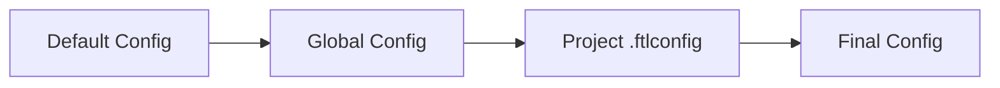

FTL uses a layered configuration system: global defaults in `~/.ftl/config.json` set during `ftl setup`, overridden by per-project `.ftlconfig` files.

## Configuration Files

### Global Configuration

`~/.ftl/config.json` stores machine-wide defaults set by `ftl setup`:

```json ~/.ftl/config.json
{
  "agent": "claude-code",
  "tester": "claude-haiku-4-5-20251001"
}
```

<Note>
  Global config is used as the template when you run `ftl init` in a new project.
</Note>

### Project Configuration

`.ftlconfig` in your project root defines per-project settings:

```json .ftlconfig
{
  "agent": "claude-code",
  "tester": "claude-haiku-4-5-20251001"
}
```

## Configuration Precedence

Settings are merged in this order:



1. **Default values** - Built-in FTL defaults
2. **Global config** - `~/.ftl/config.json`
3. **Project config** - `.ftlconfig` in project root

## Full Configuration Schema

```json .ftlconfig
{
  "agent": "claude-code",
  "tester": "claude-haiku-4-5-20251001",

  "shadow_env": ["MY_EXTRA_SECRET"],
  "agent_env": ["SOME_VAR_TO_FORWARD"],

  "setup": "pip install -r requirements.txt 2>/dev/null; npm install --silent 2>/dev/null; true",

  "snapshot_backend": "local",
  "s3_bucket": "my-ftl-snapshots",
  "cloudwatch_log_group": "/ftl/myproject",
  "secrets_manager_prefix": "/myproject/prod/",
  "guardrail_id": "abc123def456",
  "guardrail_version": "1"
}
```

## Configuration Fields

### Core Settings

<ParamField path="agent" type="string" default="claude-code" required>
  Agent to run. Options: `"claude-code"`, `"codex"`, `"aider"`, `"kiro"`
</ParamField>

<ParamField path="tester" type="string" default="claude-haiku-4-5-20251001" required>
  LiteLLM model string for adversarial test generation
</ParamField>

### Environment Variables

<ParamField path="shadow_env" type="array" default="[]">
  Extra environment variable names to shadow beyond what's in `.env`
  
  ```json
  {
    "shadow_env": ["DATABASE_URL", "STRIPE_SECRET_KEY"]
  }
  ```
</ParamField>

<ParamField path="agent_env" type="array" default="[]">
  Environment variables from your host to forward into the sandbox
  
  ```json
  {
    "agent_env": ["NODE_ENV", "DEBUG"]
  }
  ```
</ParamField>

### Setup Hook

<ParamField path="setup" type="string">
  Shell command run once on a **fresh container only**, before the agent starts
  
  ```json
  {
    "setup": "pip install -r requirements.txt 2>/dev/null; npm install --silent 2>/dev/null; true"
  }
  ```
  
  The `true` at the end prevents missing files from failing the boot. On warm container reuse, this command is skipped.
</ParamField>

### Snapshot Storage

<ParamField path="snapshot_backend" type="string" default="local">
  Snapshot storage backend: `"local"` or `"s3"`
</ParamField>

<ParamField path="s3_bucket" type="string">
  S3 bucket name. Required when `snapshot_backend` is `"s3"`
  
  ```json
  {
    "snapshot_backend": "s3",
    "s3_bucket": "ftl-123456789012-us-east-1"
  }
  ```
</ParamField>

### AWS Integration

<ParamField path="cloudwatch_log_group" type="string">
  CloudWatch log group for session traces
  
  ```json
  {
    "cloudwatch_log_group": "/ftl/myproject"
  }
  ```
</ParamField>

<ParamField path="secrets_manager_prefix" type="string">
  AWS Secrets Manager prefix. When set, replaces `.env` as the secrets source
  
  ```json
  {
    "secrets_manager_prefix": "/myproject/prod/"
  }
  ```
  
  Secrets with JSON object values are expanded into individual keys. Plain-string secrets use the last path segment as the key name, uppercased.
</ParamField>

<ParamField path="guardrail_id" type="string">
  Bedrock Guardrail ID. When set, replaces the local lint scan with a Bedrock Guardrail that hard-blocks merge if it intervenes
  
  ```json
  {
    "guardrail_id": "abc123def456",
    "guardrail_version": "1"
  }
  ```
</ParamField>

<ParamField path="guardrail_version" type="string" default="DRAFT">
  Guardrail version to apply
</ParamField>

## Tester Model Configuration

The `tester` field accepts any [LiteLLM-supported model](https://docs.litellm.ai/docs/providers):

<Tabs>
  <Tab title="Anthropic Direct">
    Default option using Anthropic API:
    
    ```json .ftlconfig
    {
      "tester": "claude-haiku-4-5-20251001"
    }
    ```
    
    Requires `ANTHROPIC_API_KEY`.
  </Tab>
  
  <Tab title="AWS Bedrock">
    Use Claude via AWS Bedrock:
    
    ```json .ftlconfig
    {
      "tester": "bedrock/us.anthropic.claude-sonnet-4-6"
    }
    ```
    
    Requires AWS credentials.
  </Tab>
  
  <Tab title="OpenAI">
    Use OpenAI models:
    
    ```json .ftlconfig
    {
      "tester": "openai/gpt-4o-mini"
    }
    ```
    
    Requires `OPENAI_API_KEY`.
  </Tab>
  
  <Tab title="Disable Testing">
    Skip test generation:
    
    ```json .ftlconfig
    {
      "tester": ""
    }
    ```
  </Tab>
</Tabs>

<Info>
  The tester runs in parallel with the agent, so model latency doesn't add to wall-clock time.
</Info>

## Setup Examples

### Basic Python Project

```json .ftlconfig
{
  "agent": "claude-code",
  "tester": "claude-haiku-4-5-20251001",
  "setup": "pip install -r requirements.txt 2>/dev/null; true",
  "shadow_env": ["DATABASE_URL", "STRIPE_SECRET_KEY"]
}
```

### Node.js Project

```json .ftlconfig
{
  "agent": "claude-code",
  "tester": "claude-haiku-4-5-20251001",
  "setup": "npm install --silent 2>/dev/null; true",
  "shadow_env": ["SUPABASE_URL", "SUPABASE_ANON_KEY"]
}
```

### Full-Stack with AWS

```json .ftlconfig
{
  "agent": "claude-code",
  "tester": "bedrock/us.anthropic.claude-sonnet-4-6",
  "setup": "pip install -r requirements.txt 2>/dev/null; npm install --silent 2>/dev/null; true",
  
  "snapshot_backend": "s3",
  "s3_bucket": "ftl-123456789012-us-east-1",
  "cloudwatch_log_group": "/ftl/myproject",
  "secrets_manager_prefix": "/myproject/prod/",
  "guardrail_id": "gr1a2b3c4d5e",
  "guardrail_version": "1",
  
  "shadow_env": ["DATABASE_URL", "STRIPE_SECRET_KEY", "OPENAI_API_KEY"]
}
```

## Initializing Configuration

<Steps>
  <Step title="Run ftl init">
    Create `.ftlconfig` in your project root:
    
    ```bash
    cd your-project
    ftl init
    ```
    
    This creates `.ftlconfig` with values from your global config.
  </Step>
  
  <Step title="Edit .ftlconfig">
    Customize settings for your project:
    
    ```json .ftlconfig
    {
      "agent": "claude-code",
      "tester": "claude-haiku-4-5-20251001",
      "setup": "pip install -r requirements.txt"
    }
    ```
  </Step>
  
  <Step title="Commit to Git">
    Add `.ftlconfig` to version control:
    
    ```bash
    git add .ftlconfig
    git commit -m "Add FTL configuration"
    ```
  </Step>
</Steps>

## AWS Quick Setup

Provision all AWS resources and update `.ftlconfig` in one command:

```bash
ftl config --aws
```

This wizard:

<Steps>
  <Step title="Reads AWS Identity">
    Uses STS to get your account ID and region
  </Step>
  
  <Step title="Creates S3 Bucket">
    Creates `ftl-<account>-<region>` (idempotent)
  </Step>
  
  <Step title="Creates CloudWatch Log Group">
    Creates `/ftl/<project-name>` (idempotent)
  </Step>
  
  <Step title="Creates Bedrock Guardrail">
    Creates `ftl-<project-name>` with PII and credential blocking
  </Step>
  
  <Step title="Prompts for Secrets Manager">
    Optional Secrets Manager prefix for secret storage
  </Step>
  
  <Step title="Updates .ftlconfig">
    Merges all resource IDs into your project config
  </Step>
</Steps>

<Warning>
  Running `ftl config --aws` requires:
  - `pip install -e ".[aws]"` for boto3
  - AWS credentials configured (via `aws configure` or `ftl auth`)
</Warning>

## Finding Configuration

FTL walks up from the current directory to find `.ftlconfig`, similar to how Git finds `.git`:

```python
from pathlib import Path

def find_config():
    current = Path.cwd()
    for parent in [current, *current.parents]:
        config_path = parent / ".ftlconfig"
        if config_path.exists():
            return config_path
    return None
```

This allows you to run `ftl` commands from any subdirectory in your project.

## Configuration Validation

FTL validates that required keys are present:

```python
REQUIRED_KEYS = {"agent", "tester"}

missing = REQUIRED_KEYS - set(config.keys())
if missing:
    raise ValueError(f"Missing required keys in .ftlconfig: {missing}")
```

If validation fails, FTL exits with a clear error message.
