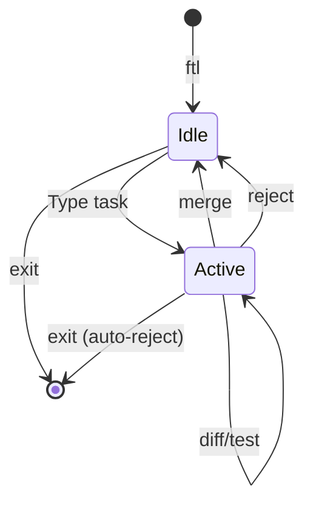

The FTL interactive shell provides a persistent session where you can issue follow-up instructions to the agent without cold-booting between tasks.

## Starting the Shell

Launch the interactive shell from your project directory:

```bash
ftl
```

<Note>
  You must run `ftl init` in your project before using the interactive shell.
</Note>

## Shell Prompt States

The shell has two prompt states:

<Tabs>
  <Tab title="Idle">
    ```bash
    ftl>
    ```
    
    No active session. Type a task to start a new session.
  </Tab>
  
  <Tab title="Active Session">
    ```bash
    ftl[active]>
    ```
    
    Session is active. Follow-up instructions continue the same agent conversation.
  </Tab>
</Tabs>

## Basic Workflow

<Steps>
  <Step title="Start Shell">
    ```bash
    ftl
    ```
    
    Output:
    ```
    FTL Shell
    Agent: claude-code | Tester: claude-haiku-4-5-20251001
    Type a task to start. Commands: test, diff, merge, reject, list, restore <id>, exit

    ftl>
    ```
  </Step>
  
  <Step title="Issue Task">
    Type a task description to start a new session:
    
    ```bash
    ftl> build a login page with email and password
    ```
    
    FTL snapshots your project, boots the sandbox, and runs the agent.
  </Step>
  
  <Step title="Review Changes">
    Once the agent completes, the session becomes active:
    
    ```bash
    Session active. Commands: test, diff, merge, reject
    Or type a follow-up instruction for the agent.

    ftl[active]>
    ```
  </Step>
  
  <Step title="Follow-up Instructions">
    Continue the conversation with follow-up tasks:
    
    ```bash
    ftl[active]> add form validation
    ```
    
    The agent continues in the same container with full context.
  </Step>
  
  <Step title="Merge or Reject">
    When satisfied, merge the changes:
    
    ```bash
    ftl[active]> merge
    ```
    
    Or reject to discard all changes:
    
    ```bash
    ftl[active]> reject
    ```
  </Step>
</Steps>

## Session Commands

These commands are available when a session is active:

### diff

Show all changes since the snapshot:

```bash
ftl[active]> diff
```

Displays a unified diff of all modified files.

### test

Re-run tests manually:

```bash
ftl[active]> test
```

Executes the adversarial tests generated for this session.

### merge

Review and merge changes to your project:

```bash
ftl[active]> merge
```

FTL displays the diff and prompts for approval:

<CodeGroup>
```bash Interactive Review
ftl[active]> merge

[Diff displayed]

Approve changes?
  a — approve and merge
  r — reject and discard
  Any other input — ask the model a question

>
```

```bash Approve
> a
[green]Changes merged to project.[/green]

ftl>
```

```bash Reject
> r
[red]Changes discarded.[/red]

ftl>
```

```bash Ask Question
> does this handle null inputs?
[Model responds with analysis]

Approve changes?
>
```
</CodeGroup>

### reject

Discard all changes and end the session:

```bash
ftl[active]> reject
```

The sandbox state is discarded and the prompt returns to `ftl>`.

## Snapshot Commands

These commands are available at any time:

### list

List snapshots for the current project:

```bash
ftl> list
```

Output:
```
  abc123  /home/user/myproject
  def456  /home/user/myproject
  ghi789  /home/user/myproject
```

### list all

List snapshots for all projects:

```bash
ftl> list all
```

### restore

Restore a previous snapshot:

```bash
ftl> restore abc123
```

FTL prompts for confirmation before restoring:

```
Restore snapshot abc123?
Are you sure? (y/n) >
```

## Example Session

Here's a complete interactive session:

```bash
$ ftl
FTL Shell
Agent: claude-code | Tester: claude-haiku-4-5-20251001

ftl> create a Stripe payment module

[Snapshotting...]
[Booting sandbox...]
[Running agent...]
[Agent completes]

Session active. Commands: test, diff, merge, reject

ftl[active]> add error handling for failed payments

[Agent continues...]
[Agent completes]

ftl[active]> diff

[Unified diff displayed]

ftl[active]> test

[Tests run]
All tests passed.

ftl[active]> merge

[Diff displayed]

Approve changes?
  a — approve and merge
  r — reject and discard
  Any other input — ask the model a question

> does this handle webhook signature verification?

Yes, the implementation includes webhook signature verification using
Stripe's constructEvent() method with the webhook secret...

Approve changes?
> a

Changes merged to project.

ftl> exit
Goodbye.
```

## Session Lifecycle



### Persistent Container

The shell uses a persistent container per project:

| Location | Behavior | Notes |
|----------|----------|-------|
| `/workspace/` | Wiped and restored from snapshot on each task | Project files |
| `/home/ftl/.local/` | Persists across tasks | `pip install` packages |
| `/home/ftl/.claude/` | Persists across tasks | Conversation history |
| Global node_modules | Persists across tasks | `npm install -g` |

### Follow-up Context

When you issue a follow-up instruction:

<Steps>
  <Step title="Same Container">
    The agent runs in the same container with all previous context
  </Step>
  
  <Step title="Same Conversation">
    Conversation history in `/home/ftl/.claude/` is preserved
  </Step>
  
  <Step title="No Snapshot">
    FTL does not create a new snapshot for follow-ups
  </Step>
  
  <Step title="Cumulative Diff">
    The diff shows all changes since the original snapshot
  </Step>
</Steps>

## Exiting the Shell

Exit the shell with any of these:

<CodeGroup>
```bash exit command
ftl> exit
Goodbye.
```

```bash quit command
ftl> quit
Goodbye.
```

```bash Ctrl+C
ftl> ^C
Goodbye.
```

```bash Ctrl+D (EOF)
ftl> ^D
Goodbye.
```
</CodeGroup>

<Warning>
  If you exit with an active session, FTL automatically rejects all changes to prevent accidental merges.
</Warning>

## Shell Implementation

The shell is implemented in `ftl/cli.py`:

```python ftl/cli.py
def shell():
    """Interactive FTL shell with session support."""
    console = Console()

    if not find_config():
        console.print("[red]No .ftlconfig found. Run 'ftl init' first.[/red]")
        raise SystemExit(1)

    config = load_config()
    console.print("[bold]FTL Shell[/bold]")
    console.print(f"[dim]Agent: {config['agent']} | Tester: {config['tester']}[/dim]")
    console.print("[dim]Type a task to start. Commands: test, diff, merge, reject, list, restore <id>, exit[/dim]\n")

    from ftl.snapshot import create_snapshot_store
    snapshot_store = create_snapshot_store(config)
    session = None

    while True:
        prompt = "ftl[active]> " if session and session.is_active else "ftl> "
        try:
            user_input = input(prompt).strip()
        except (KeyboardInterrupt, EOFError):
            console.print("\n[dim]Goodbye.[/dim]")
            if session and session.is_active:
                session.reject()
            break

        if not user_input:
            continue

        if user_input in ("exit", "quit"):
            if session and session.is_active:
                session.reject()
            break

        # [Command handling logic]
```

## Tips

<AccordionGroup>
  <Accordion title="Use follow-ups for refinement">
    Instead of crafting perfect initial instructions, start with a basic task and refine with follow-ups:
    
    ```bash
    ftl> create a login form
    ftl[active]> add client-side validation
    ftl[active]> add password strength indicator
    ftl[active]> add remember me checkbox
    ```
  </Accordion>
  
  <Accordion title="Check diffs before merging">
    Always run `diff` before `merge` to review all accumulated changes:
    
    ```bash
    ftl[active]> diff
    ftl[active]> merge
    ```
  </Accordion>
  
  <Accordion title="Use list to track snapshots">
    Run `list` to see all snapshots for the current project:
    
    ```bash
    ftl> list
    ```
    
    Use `restore <id>` if you need to revert to a previous state.
  </Accordion>
  
  <Accordion title="Test early and often">
    Run tests manually after each follow-up to catch issues early:
    
    ```bash
    ftl[active]> add error handling
    ftl[active]> test
    ```
  </Accordion>
</AccordionGroup>
